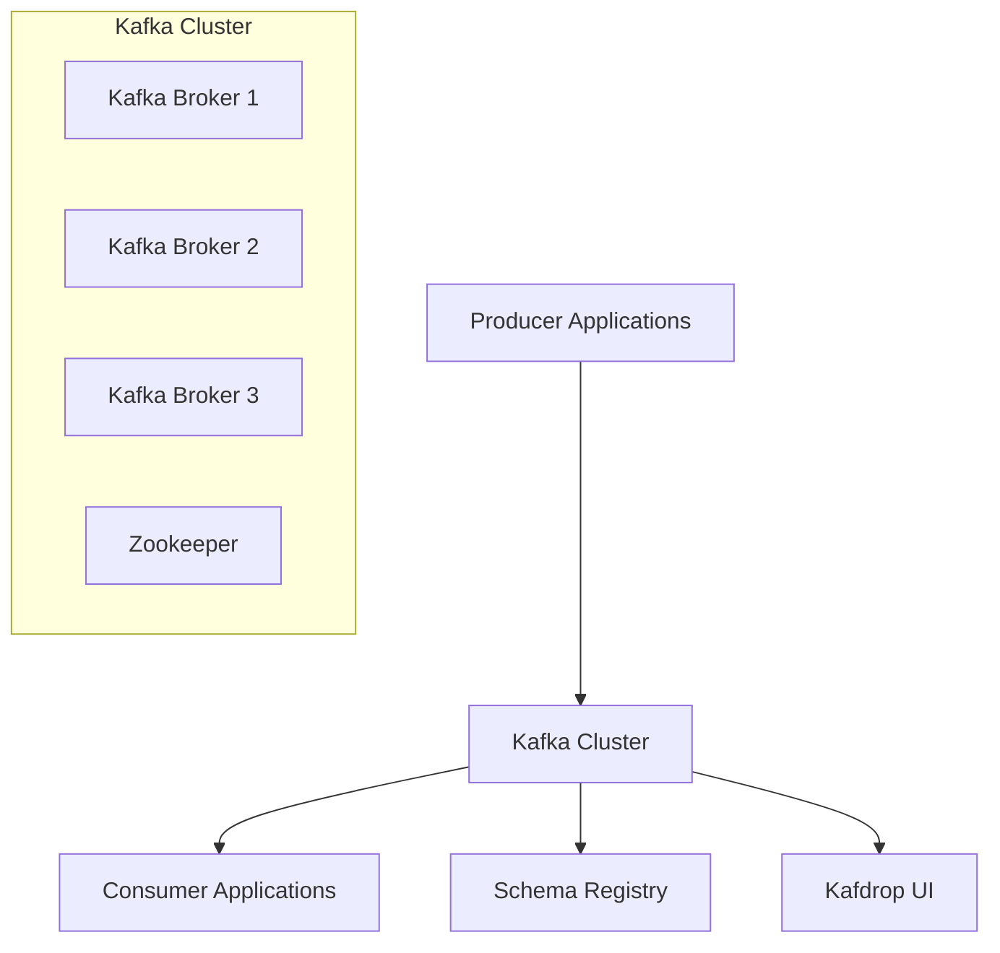

# 🚀 Kafka Experiments

A comprehensive collection of Apache Kafka integration examples demonstrating various patterns, frameworks, and best practices for building real-time data streaming applications.

## 📖 Overview

**Apache Kafka** is an open-source, distributed streaming platform that enables real-time processing of data streams. It is designed to handle high-throughput, low-latency processing of large volumes of data, making it ideal for:

- 📊 **Real-time analytics**
- 🏗️ **Event-driven architectures**
- 🔄 **Data pipelines**
- 📈 **Stream processing applications**

### 🎯 Core Concepts

Kafka operates on a **publish-subscribe model** where:
- **Producers** send data to Kafka topics
- **Consumers** subscribe to topics to receive data
- Data is stored in a **distributed, partitioned, and replicated log structure**

### ✨ Key Features

| Feature                | Description                                                     |
|------------------------|-----------------------------------------------------------------|
| **🔧 Scalability**     | Handle millions of messages per second with horizontal scaling  |
| **💾 Durability**      | Persist messages on disk for fault tolerance and data integrity |
| **⚡ Low Latency**      | Optimized for real-time, low-latency message processing         |
| **📈 High Throughput** | Process large volumes of data streams efficiently               |
| **🔄 Flexibility**     | Support diverse use cases from analytics to event sourcing      |

## 🗂️ Project Structure

This repository contains practical examples organized by integration patterns and frameworks:

### 📋 Available Examples

| Category                 | Project                                                           | Description                            | Key Features                                                                              |
|--------------------------|-------------------------------------------------------------------|----------------------------------------|-------------------------------------------------------------------------------------------|
| **📝 Schema Management** | [Kafka Avro](./kafka-avro/README.md)                              | Schema evolution with Apache Avro      | • Backward/Forward compatibility<br>• Schema Registry integration<br>• Version management |
| **🔧 Configuration**     | [DSL Integration](./integration/spring-dsl-integration/ReadMe.md) | Domain-specific language configuration | • Fluent API configuration<br>• Type-safe setup                                           |
| **⚛️ Reactive**          | [Kafka Reactor](./kafka-reactor/README.md)                        | Non-blocking reactive streams          | • Project Reactor integration<br>• Backpressure handling<br>• Async processing            |
| **☕ Core Java**          | [Java Samples](./kafka-sample/README.md)                          | Plain Java and Spring examples         | • Pure Java clients<br>• Spring Framework integration                                     |
| **🌱 Spring Boot**       | [Spring Boot Examples](./kafka-spring-boot/README.md)             | Production-ready Spring Boot apps      | • Auto-configuration<br>• Error handling<br>• Listener management                         |
| **☁️ Cloud Native**      | [Spring Cloud](./kafka-spring-cloud-sample/README.md)             | Cloud-native microservices             | • Spring Cloud Stream<br>• Binder abstraction<br>• Batch processing                       |
| **🌊 Stream Processing** | [Kafka Streams](./kafka-streams/README.md)                        | Real-time stream processing            | • Stateful operations<br>• Stream topology<br>• Real-time analytics                       |
| **📦 Event Sourcing**    | [Outbox Pattern](./spring-modulith-outbox-pattern/README.md)      | Transactional outbox with Modulith     | • Event sourcing<br>• Transactional consistency<br>• Domain events                        |

## 🚀 Getting Started

### 📋 Prerequisites

Before running any of the examples, ensure you have the following installed:

- **Java 21+** ☕
- **Maven 3.9+** 📦
- **Docker & Docker Compose** 🐳
- **Git** 📝

### ⚡ Quick Start

1. **Clone the repository**
   ```bash
   git clone https://github.com/rajadilipkolli/kafka-experiments.git
   cd kafka-experiments
   ```

2. **Start Kafka infrastructure**
   ```bash
   # Use the cluster setup for multiple examples
   docker-compose -f docker-compose-cluster.yml up -d
   
   # Or use individual project docker-compose files
   ```

3. **Choose an example and follow its README**
   ```bash
   cd kafka-spring-boot/boot-kafka-sample
   ./mvnw spring-boot:run
   ```

### 🏗️ Architecture Overview



## 🎯 Use Cases Demonstrated

### 📊 Data Processing Patterns

| Pattern              | Example Project     | Use Case                                 |
|----------------------|---------------------|------------------------------------------|
| **Request-Response** | Spring Boot Samples | Synchronous message processing           |
| **Event Streaming**  | Kafka Streams       | Real-time data transformation            |
| **Event Sourcing**   | Outbox Pattern      | Audit trails and state reconstruction    |
| **CQRS**             | Multiple projects   | Command-Query Responsibility Segregation |

### 🔧 Integration Patterns

- **Schema Evolution**: Backward and forward compatible message formats
- **Error Handling**: Dead letter queues and retry mechanisms
- **Batch Processing**: High-throughput batch message consumption
- **Reactive Streams**: Non-blocking, backpressure-aware processing
- **Transactional Outbox**: Ensuring data consistency across services

## 🛠️ Development Features

### 🧪 Testing

Each project includes comprehensive testing strategies:

- **Unit Tests**: Individual component testing
- **Integration Tests**: Kafka integration with Testcontainers
- **Contract Tests**: Schema compatibility testing
- **Performance Tests**: Load and throughput testing

### 📊 Monitoring & Observability

- **Kafdrop UI**: Topic and message inspection
- **Actuator Endpoints**: Application health and metrics
- **Distributed Tracing**: Request flow tracking
- **Custom Metrics**: Business-specific monitoring

### 🔒 Security & Best Practices

- **Authentication**: SASL/SCRAM and SSL configurations
- **Authorization**: ACL-based access control
- **Encryption**: In-transit and at-rest data protection
- **Error Handling**: Comprehensive exception management

## 🛡️ Production Considerations

### 📈 Performance Tuning

- **Partitioning Strategy**: Optimal partition count and key distribution
- **Batch Configuration**: Balancing latency vs. throughput
- **Memory Management**: JVM tuning for high-throughput scenarios
- **Network Optimization**: Compression and connection pooling

### 🔄 Operational Excellence

- **Monitoring**: Comprehensive metrics and alerting
- **Backup & Recovery**: Data retention and disaster recovery
- **Deployment**: Blue-green and rolling deployment strategies
- **Scaling**: Horizontal and vertical scaling patterns

## 📚 Learning Path

### 🎓 Beginner
1. Start with [Java Samples](./kafka-sample/README.md) for basic concepts
2. Explore [Spring Boot Examples](./kafka-spring-boot/README.md) for practical applications
3. Try [Kafka Avro](./kafka-avro/README.md) for schema management

### 🚀 Intermediate
1. Implement [Reactive Patterns](./kafka-reactor/README.md) for scalability
2. Build [Stream Processing](./kafka-streams/README.md) applications
3. Explore [Cloud Integration](./kafka-spring-cloud-sample/README.md)

### 🎯 Advanced
1. Master [Event Sourcing](./spring-modulith-outbox-pattern/README.md) patterns
2. Implement custom [DSL Integration](./integration/spring-dsl-integration/ReadMe.md)
3. Design complex event-driven architectures

## 🤝 Contributing

We welcome contributions! Please see our contributing guidelines:

1. **Fork** the repository
2. **Create** a feature branch
3. **Follow** coding standards and add tests
4. **Submit** a pull request with clear description

### 📝 Code Standards

- Use **Spotless** for code formatting: `./mvnw spotless:apply`
- Write **comprehensive tests** with good coverage
- Follow **Spring Boot best practices**
- Document **complex configurations**

## 📖 Additional Resources

### 📚 Documentation
- [Apache Kafka Documentation](https://kafka.apache.org/documentation/)
- [Spring for Apache Kafka](https://spring.io/projects/spring-kafka)
- [Confluent Developer Guides](https://developer.confluent.io/)

### 🎬 Video Tutorials
- [Kafka Streams Tutorial](https://youtu.be/YPDzcmqwCNo) - Referenced in streams example

### 🔗 Related Projects
- [Spring Boot Kafka Testcontainers](https://github.com/eddumelendez/spring-boot-kafka-testcontainers-reusable-mode)

## � Support & Community

### 💬 Getting Help

- **Issues**: Report bugs or request features via [GitHub Issues](https://github.com/rajadilipkolli/kafka-experiments/issues)
- **Discussions**: Join community discussions for questions and ideas
- **Documentation**: Each project has detailed README with setup instructions

### 🏷️ Tags & Topics

`kafka` `spring-boot` `microservices` `event-driven` `streaming` `java` `reactive` `avro` `schema-registry` `testcontainers`

## �📄 License

This project is licensed under the MIT License - see the [LICENSE](LICENSE) file for details.

## 🙏 Acknowledgments

Copied and modified from [sivalabs](https://github.com/sivaprasadreddy/kafka-tutorial) with additional enhancements and examples.

---

**⭐ Star this repository if you find it helpful!**

**🐛 Found an issue? Please create an issue or submit a PR!**
