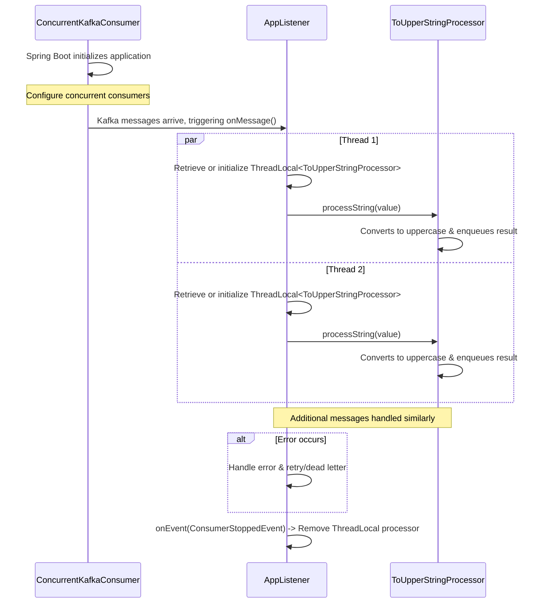

# Concurrent Kafka Consumer

This project demonstrates a multi-threaded Kafka consumer approach using Spring Boot, with a dedicated implementation that processes messages concurrently across different threads.

### Sequence Diagram



## Project Structure

### 1. `ConcurrentKafkaConsumer`
- **Location**: `com.example.kafka`
- **Description**: 
  - Serves as the Spring Boot application entry point.
  - Annotated with `@SpringBootApplication`.
  - The `main` method runs the Spring application using `SpringApplication.run`.

### 2. `AppListener`
- **Location**: `com.example.kafka.listener`
- **Description**: 
  - A `@Component` that subscribes to a Kafka topic (referenced by `SPRING_KAFKA_TEST_TOPIC`).
  - Uses a `ThreadLocal<ToUpperStringProcessor>` to manage message processing on a per-thread basis.
  - Processes messages in the `onMessage` method and handles resource cleanup in `onEvent` when the consumer stops.

### 3. `ToUpperStringProcessor`
- **Location**: `com.example.kafka.processor`
- **Description**: 
  - A `@Component` with prototype scope, ensuring each instance is unique (e.g., one per thread).
  - Transforms incoming strings to uppercase and stores them in a `BlockingQueue`.
  - Offers methods like `distinctQueuedData()` to retrieve unique processed values.

## Message Processing Sequence

1. **Startup and Configuration**  
   - The `ConcurrentKafkaConsumer` class launches the Spring Boot application.  
   - Kafka consumer properties are configured in `application.properties`, including concurrency level and bootstrap servers.

2. **Receiving Messages**  
   - The `AppListener` class is annotated with `@KafkaListener`, making it an endpoint for Kafka messages.  
   - When a message arrives, `onMessage` is triggered, and a `ToUpperStringProcessor` is retrieved or created for the current thread.

3. **Processing**  
   - The processor converts the message to uppercase and stores it in a thread-safe queue.  
   - Each thread maintains its own `ToUpperStringProcessor`, eliminating conflicts between parallel consumers.

4. **Resource Cleanup**  
   - When a consumer stops, `AppListener`’s `onEvent` method removes the processor from its `ThreadLocal`, preventing resource leaks.

## Running the Application

1. **Build and Start**  

    ```
    ./mvnw clean package
    ./mvnw spring-boot:run
    ```

2. **Send Kafka Messages**  
   Send messages to the topic defined in `application.properties` (default is `SPRING_KAFKA_TEST_TOPIC`).
3. **Observe Logs**  
   Each thread logs its own unique processor ID and message processing. Check the console or log files for details.

## Key Advantages
- **Increased Throughput**: Multiple threads can consume and process messages in parallel.  
- **Isolation**: Each thread has a dedicated processor, avoiding synchronization overload.  
- **Scalability**: The concurrency level can be fine-tuned via application properties.


### Format code

```shell
./mvnw spotless:apply
```

### Run tests

```shell
./mvnw clean verify
```

### Run locally

```shell
$ docker-compose -f docker/docker-compose.yml up -d
$ ./mvnw spring-boot:run -Dspring-boot.run.profiles=local
```

### Using Testcontainers at Development Time
You can run `TestConcurrentKafkaConsumer.java` from your IDE directly.
You can also run the application using Maven as follows:

```shell
./mvnw spring-boot:test-run
```


### Useful Links
* Actuator Endpoint: http://localhost:8080/actuator
